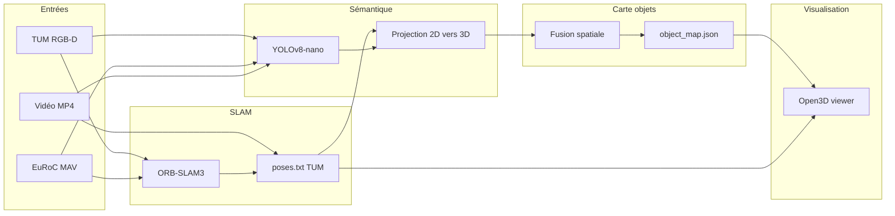

# Architecture — Rescue-Net Phase 1

## Vue d'ensemble

Phase 1 implémente un pipeline **offline mono-robot** qui transforme des séquences vidéo/RGB-D en une **carte sémantique légère** : un dictionnaire JSON d'objets 3D géolocalisés, au lieu d'un nuage de points dense.



## Modules

### `slam/` — Estimation de pose

- **ORB-SLAM3** (C++) estime la trajectoire caméra.
- `run_slam.sh` encapsule les binaires TUM RGB-D et EuRoC monocular.
- Sortie : `poses.txt` au format TUM (`timestamp tx ty tz qx qy qz qw`).

Sans SLAM, le pipeline accepte `--identity-poses` pour tester la chaîne sémantique seule.

### `semantic/` — Détection et géolocalisation

| Fichier | Rôle |
|---------|------|
| `detector.py` | YOLOv8-nano, mapping COCO → classes rescue |
| `projector.py` | Back-projection RGB-D (TUM) ou mono (EuRoC/vidéo) |
| `dataset_loaders.py` | Itérateurs frames TUM, EuRoC, vidéo |

**Projection RGB-D** : depth au centre de la bbox → point 3D caméra → transformée monde via pose SLAM.

**Projection mono** : profondeur estimée par `(fy × hauteur_objet) / hauteur_bbox_px` (échelle relative).

### `mapping/` — Carte et fusion

| Fichier | Rôle |
|---------|------|
| `object_map.py` | Modèle `SemanticObject`, sérialisation JSON |
| `fusion.py` | Cluster spatial greedy (même classe, < 0.5 m) |

Chaque objet fusionné agrège plusieurs observations et augmente la confiance.

### `viz/` — Visualisation

- Trajectoire caméra (lignes bleues)
- Objets sémantiques (sphères colorées par classe)
- Export PLY headless (`map_snapshot.ply`)

### `scripts/run_pipeline.py` — Orchestration

Point d'entrée unique. Flags principaux :

- `--dataset tum|euroc|video`
- `--run-slam` : lance ORB-SLAM3 avant le pipeline Python
- `--identity-poses` : bypass SLAM
- `--stride N` : sous-échantillonnage temporel (perf)

## Modèle de données

```python
SemanticObject:
  id: str              # UUID
  class_name: str      # victim, blocked_exit, ...
  position: [x, y, z]  # monde
  confidence: float
  observations: int    # vues concordantes
  last_seen_ts: float
  agent_id: str        # "robot_0" en Phase 1
  bbox3d: optional
```

Taille typique : **~300–500 octets/objet** → carte < 100 Ko pour 10–50 objets.

## Configurations

| Fichier | Contenu |
|---------|---------|
| `config/datasets.yaml` | Chemins datasets locaux |
| `config/semantic/classes.yaml` | Classes MVP, seuils, couleurs, fusion |
| `config/slam/tum_rgbd.yaml` | Intrinsèques Freiburg1 + binaires ORB |
| `config/slam/euroc_mono.yaml` | Intrinsèques EuRoC + depth mono |

## Choix techniques et limites Phase 1

| Choix | Justification | Limite |
|-------|---------------|--------|
| YOLO COCO pretrained | Zero-shot, rapide à intégrer | Pas adapté sinistre réel |
| Open3D vs ROS | Offline, sans infra robot | Pas de sim temps réel |
| Fusion greedy | Simple, suffisant mono-agent | Pas optimal multi-agent |
| ORB-SLAM3 externe | Standard académique | Build C++ lourd |

## Phase 2+ (hors périmètre)

- Protobuf + gRPC pour sync inter-robots
- Mesh P2P (BATMAN-adv / libp2p)
- Fine-tuning YOLO sur dataset sinistre
- Visualisation AR (Unity / WebXR)
- Association inter-agents ( même victime vue par 2 robots )
